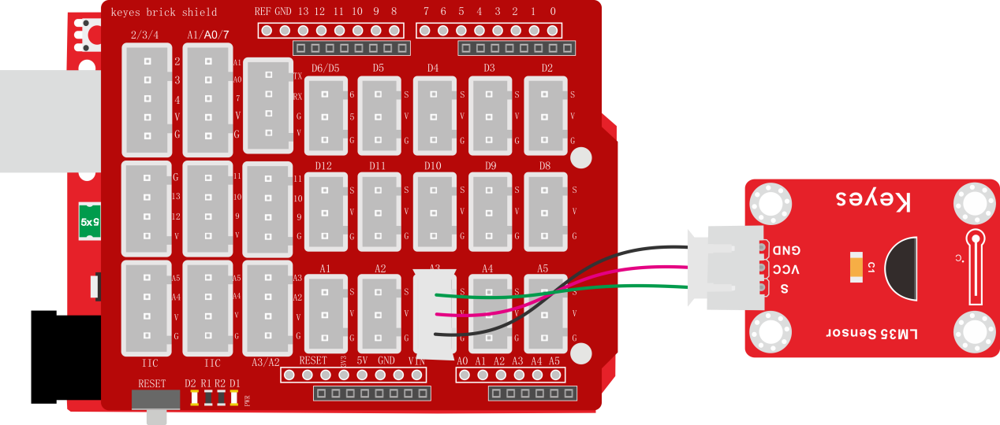
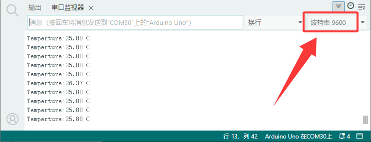

# 项目二十一 LM35温度传感器测试

## 1.实验说明

在这个套件中，有一个keyes brick LM35温度传感器，它主要采用LM35DZ传感器元件。该元件的输出电压与摄氏温标呈线性关系，转换公式如式，0时输出为0V，每升高1℃，输出电压增加10mV。

实验中，我们利用这个传感器测试当前环境中温度的大小；并且，我们在串口监视器上显示测试结果。

## 2.实验器材

- keyes brick LM35温度传感器*1

- keyes UNO R3开发板*1

- 传感器扩展板*1

- 3P 双头XH2.54连接线*1

- USB线*1

## 3.接线图



## 4.测试代码

```c
int lm35Pin = A3;
float temperature = 0;

void setup() {
  Serial.begin(9600);  //设置波特率9600

  //设置A3引脚为输入
  pinMode(lm35Pin, INPUT);
}

void loop() {
  int value = analogRead(A3);  //传感器接A3
  //计算温度值
  temperature = ((value * 5.0) * 100) / 1024;
  Serial.print("Temperature:");
  Serial.print(temperature);
  Serial.println(" C");  //换行打印
  delay(100);            //加延时100MS
}

```

## 5.代码说明

1. 创建一个名为“temperature”小数类型的全局变量
2. 设置串口波特率为9600
3. 将LM35的模拟值通过公式计算出温度值，公式如下：

$$
温度(°C) = (模拟读数 × 参考电压 × 100) / (分辨率位数)
$$

- **参考电压：**模块输入电压 5V

- **分辨率位数：**UNO 分辨率为1024

4. 使用串口打样温度值

## 6.测试结果

上传测试代码成功，利用USB线上电后，打开串口监视器，设置波特率为9600。串口监视器显示温度值（单位：摄氏度）


