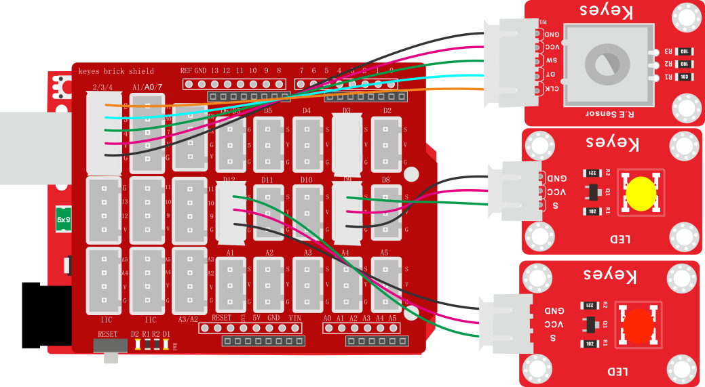
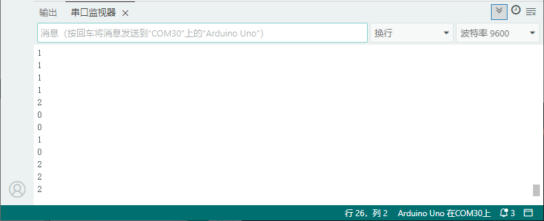

# 项目二十五 旋转编码器模块控制RGB模块

## 1.实验说明

在前面课程的项目中，利用旋转编码器计数。在这里将它扩展下，通过得出的计数，用来控制RGB模块上LED显示不同颜色。

设计代码时，需要对所得数据取绝对值。然后将数据除以3，得到余数，余数为0控制双色LED模块上LED亮红光，余数为1，双色LED模块上LED亮绿光，余数为2，双色LED模块上LED亮蓝光。

## 2.实验器材

- keyes brick 旋转编码器模块*1

- keyes UNO R3开发板*1

- keyes brick 插件RGB模块*1

- 传感器扩展板*1

- 5P双头XH2.54连接线*1

- 4P 双头XH2.54连接线*1

- USB线*1

## 3.接线图



## 4.测试代码

```c
#include <Encoder.h>
volatile int item;
volatile int val;
Encoder encoder_1(2, 3);

void setup() 
{
  item = 0;
  val = 0;
  Serial.begin(9600);
}

void loop() 
{
  item = encoder_1.read();
  val = (long) (item) % (long) (3);
  Serial.println(val);
  if (val == 0) 
  {
    analogWrite(9, 0);
    analogWrite(12, 0);
  } 
  else if (val == 1)
  {
    analogWrite(9, 255);
    analogWrite(12, 0);
  } 
  else{
    analogWrite(9, 0);
    analogWrite(12, 255);
  }
  delay(100);
}

```

## 5.代码说明

在实验中将val设置为item除以3的余数，item是编码器的值。得到余数后根据接线设置管脚为9（黄灯）、12（红灯）。参考前面实验学习的控制方法，利用余数控制模块上LED显示对应灯光颜色。

## 6.测试结果

上传测试代码成功，按照接线图接好线，上电后，打开串口监视器，设置波特率为9600。旋转编码器，串口监视器显示对应余数。即可控制外接的LED灯模块亮灭。



