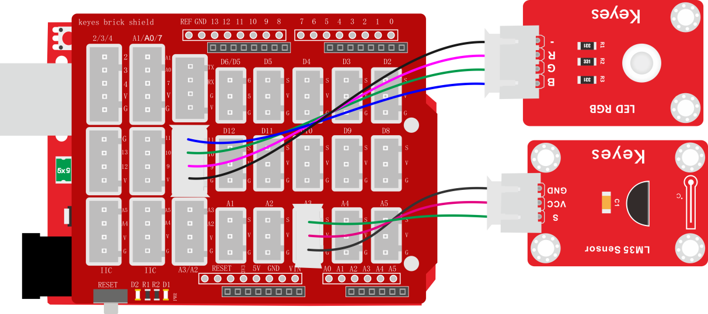
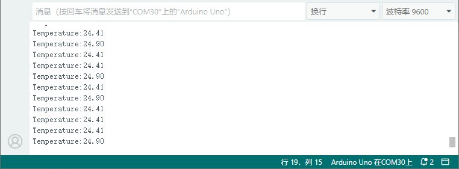

# 项目二十七 温度控制RGB灯

## 1.实验说明

在前面实验中，我们利用按键手动控制RGB模块上LED灯的颜色。在这一课程中，我们利用一个LM35温度传感器检测当前环境的温度。然后利用检测到的温度数据控制RGB模块上LED灯的颜色。

生活中，我们可以把这个电路设计应用到水杯中。我们利用温度传感器检测到水杯温度，控制水杯上LED的颜色。这样我们就可以通过LED颜色，判断水的大概温度。

## 2.实验器材

- keyes brick 插件RGB模块*1

- keyes UNO R3开发板*1

- keyes brick LM35温度传感器*1

- 传感器扩展板*1

- 4P双头XH2.54连接线*1

- 3P 双头XH2.54连接线*1

- USB线*1

## 3.接线图



## 4.测试代码

```c
int redLED = 9;     //定义控制红色LED引脚为D9
int greenLED = 10;  //定义控制绿色LED引脚为D10
int blueLED = 11;   //定义控制蓝色LED引脚为D11

//小数类型的变量用于存放温度值
float temperture = 0;

void setup() {
  Serial.begin(9600);
  //设置控制led的引脚为输出
  pinMode(redLED, OUTPUT);
  pinMode(greenLED, OUTPUT);
  pinMode(blueLED, OUTPUT);
}

void loop() {
  //计算处温度值
  temperture = ((analogRead(A3) * 5.0) * 100) / 1024;
  //打印温度值
  Serial.print("Temperature:");
  Serial.println(temperture);
  delay(100);
  //判断温度值是否小于等于27℃，如果是就亮蓝灯
  if (temperture <= 27) {
    digitalWrite(redLED, LOW);
    digitalWrite(greenLED, LOW);
    digitalWrite(blueLED, HIGH);
    //判断温度值是否大于27℃并且小于等于30℃，如果是就亮绿灯
  } else if (temperture > 27 && temperture <= 30) {
    digitalWrite(redLED, LOW);
    digitalWrite(greenLED, HIGH);
    digitalWrite(blueLED, LOW);
    //判断温度值是否大于30℃，如果是就亮红灯
  } else if (temperture > 30) {
    digitalWrite(redLED, HIGH);
    digitalWrite(greenLED, LOW);
    digitalWrite(blueLED, LOW);
  }
}
```

## 5.代码说明

1.  实验中，检测并显示温度的方法和上一课中一样。
2.  检测到温度数据后通过设置if判断控制RGB模块上的LED颜色，设置方法参考上一课中知识点。

## 6.测试结果

上传测试代码成功，按照接线图接好线，利用USB上电后，打开串口监视器，设置波特率为9600；串口监视器显示当前环境中温度数值。当温度小于等于27摄氏度时，RGB模块上的LED显示蓝色；当温度大于27且小于等于30摄氏度时，RGB模块上的LED显示绿色；当温度大于30摄氏度时，RGB模块上的LED显示红色。

