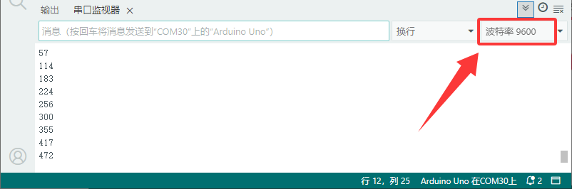

# 项目九 光敏电阻传感器测试光照强度

## 1.实验说明

在这个套件中，有一个keyes brick光敏电阻传感器，它是一个常用的光敏电阻传感器，它主要采用光敏电阻元件。该电阻元件电阻大小随着光照强度的变化而变化，当环境中有亮光的时候，电阻大小为5-10KΩ；没有亮光时，电阻大小为0.2MΩ。该传感器就是利用光敏电阻元件这一特性，搭建电路将电阻变化转换为电压变化。

实验中，我们利用这个传感器测试当前环境中的光照强度对应的模拟值，光照越强，模拟值越大；并且，我们在串口监视器上显示测试结果。

## 2.实验器材

- keyes brick 光敏电阻传感器*1

- keyes UNO R3开发板*1

- 传感器扩展板*1

- 3P双头XH2.54连接线*1

- USB线*1

## 3.接线图


## 4.测试代码

```c
volatile int item = 0;

void setup() 
{
  Serial.begin(9600);//设置波特率
}

void loop() 
{
  item = analogRead(A3);//读取光敏传感器的值
  Serial.println(item);//打印值
  delay(100);//延时100MS
}
```

## 5.代码说明

1.  在实验中，把管脚设置为A3。

2.  设置1个整数变量item，将所测结果赋值给item。

3.  串口监视器显示item的值，显示前需设置波特率（默认设置为9600，可更改）。

## 6.测试结果

上传测试代码成功，利用USB线上电后，打开串口监视器，设置波特率为9600。串口监视器显示对应模拟值。实验中，环境越亮模拟值越大，环境越暗模拟值越小，范围为0-1023，如下图。


