# 3.2.1 软件下载

软件下载Mixly 3.0（百度网盘）：[https://pan.baidu.com/s/1OLSrjoVlnWPfoD02v-MPdA?pwd=pmau](https://pan.baidu.com/s/1OLSrjoVlnWPfoD02v-MPdA?pwd=pmau)

根据自己电脑系统下载软件

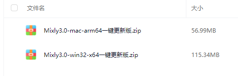

# 3.2.2 软件安装

## 3.2.2.1 Windos 系统

1. 将下载好的压缩包存放到你需要安装软件的位置，然后解压（注意：解压后文件名后面的"一键更新版"的中文字样要删除掉，以及安装路径也不能存在中文否则上传代码可能回报错）

2. 解压压缩包，打开文件夹，打开。

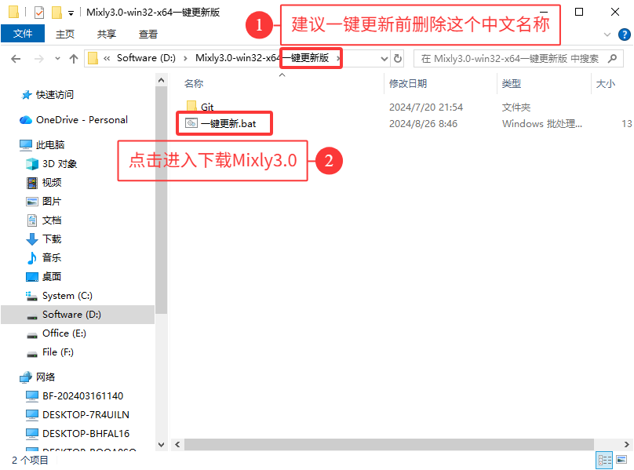

3. 需要输入的地方全部输入“y”，等待更新即可。操作完后耐心等待下载完成，下载更新完毕后，出现`请按任意键键继续...`时即可按任意键退出。

4. 再次打开文件夹，可以看到软件已存在，点击打开。

## 3.2.2.2 Mac 系统

1. 将下载好的压缩包放到软件存放的文件夹中

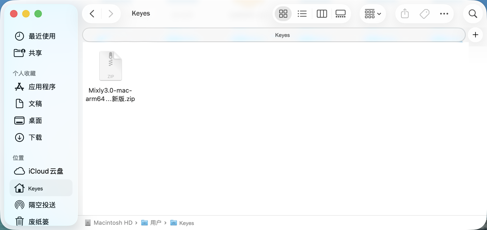

2. 双击“.zip”文件解压并删除解压后文件夹中的“一键安装版”字样，因为米思齐的安装路径不要存在中文否则可能会出报错。

3. 进入文件`Mixly3.0-mac-arm64`，点击`git-2.15.0-intel-universal-mavericks.dmg`进行安装Git，这个是必须的。

4. 打开终端，使用快捷键 **`command+空格`** 打开聚焦搜索，输入 **`terminal.app`** 并选中匹配项，**`Enter`** 后即可打开终端。

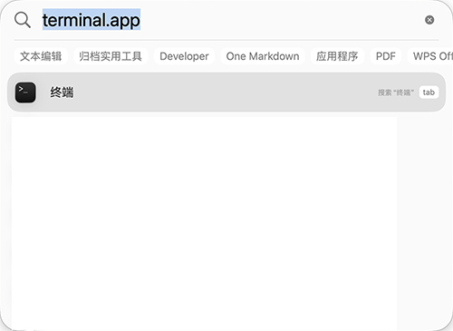

5. 进入文件夹路径，在终端中输入 **`cd [path]`** ，其中 **`[path]`** 为所解压的mixly3.0更新文件夹路径。

例如：当前mixly3.0文件夹路径为/Users/Keyes/mixly3.0-mac-arm64，则对应指令为 **`cd /Users/Keyes/mixly3.0-mac-arm64`**然后按回车键即可。

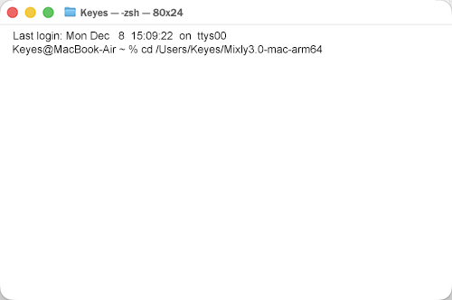

6. 开启root权限，在终端中输入 **`sudo su`** ，然后按回车键再按照提示 **`Password：`** 即可开启root权限。

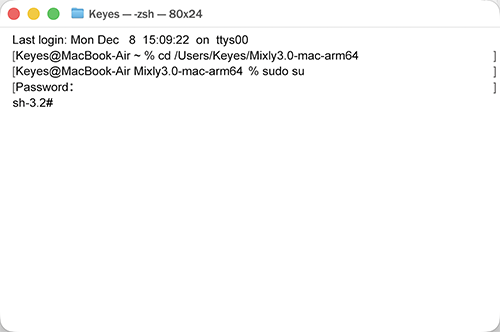

7. 在终端运行`一键更新`脚本，在终端中输入 **`sh 一键更新.sh`** ，按回车键后根据提示选择需要安装的板卡，然后等待完成，安装完成后，关闭终端。注意：以下操作必须在root下执行，否则可能会出错。

确认安装开发板

 下载并更新完成

双击米思齐图标即可进入软件。

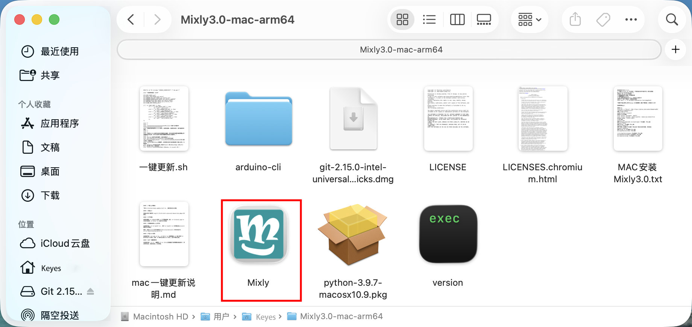

# 3.2.3 软件介绍

1. 打开软件后，通过左右两边的箭头图片切换开发板页面，我们找到Arduino AVR开发板

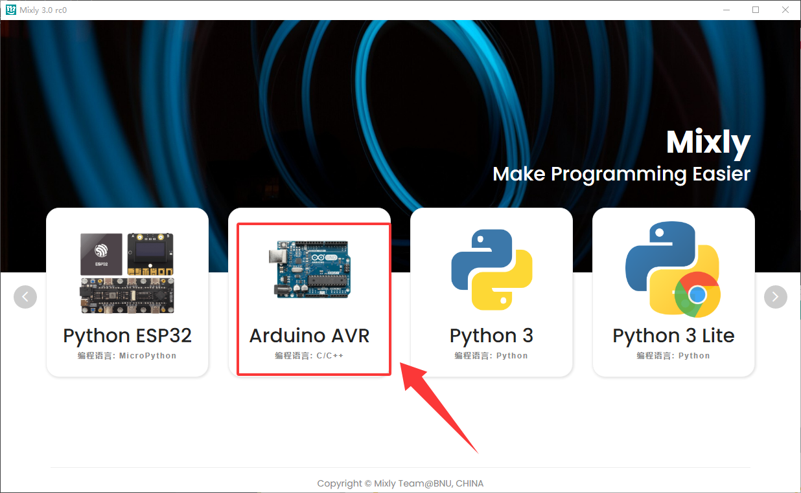

2. 点击Arduino AVR 进入编程页面

   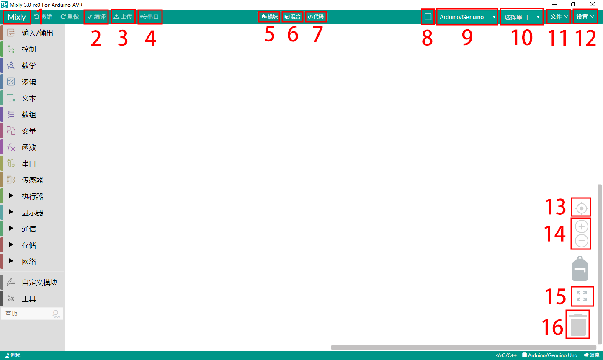

-  1：返回主页面，点击可返回到选则开发板的页面。
-  2：编译代码，检查代码是否存在错误。编译代码可以不用连接开发板，也就是如果编译代码成功上传代码失败可能问题就出在开发板上。
-  3：上传代码，上传前会自动编译代码，编译成功则会上传代码到开发板中。
-  4：串口打印，点击可进入串口打印串口，需要连接开发板并选择正确的端口才能使用。
-  5：模块模式，代码以模块形态展示。
-  6：混合模式，使用代码模块搭建的代码会在右侧展示对应的Arduino C代码。
-  7：代码模式，使用代码块搭建的代码会全屏显示为Arduino C代码。
-  8： 打开状态栏，点击会在米思齐下方打开一个状态栏，关闭也是点击它即可。
-  9：选择开发板，点击它可以选择使用到Arduino AVR框架的开发板常见的有Nano，Mega2560等。
- 10：选择串口，点击它可以选择连接到开发板的USB口，只有选择了正确的串口编号才能上传代码到开发板中。
- 11：文件，点击它可以进行以下操作---打开代码文件，新建代码文件，保存代码文件，另存为代码文件，导出库。
- 12：设置，点击它可以进行以下操作---管理库（导入库文件，删除库文件)，反馈（如果你发行软件的问题可以反馈给官方)，文档（米思齐官方提供的软件使用教程，更深入的了解米思齐的最佳途径)。
- 13：代码块大小正常化并居中。
- 14：放大以及缩小代码块按键。
- 15：在代码编辑区显示所有代码块。
- 16： 删除代码块，将代码块拖到该图标上方即可删除代码块，还有一种删除代码块的方法就是将代码块拖到代码显示栏上鼠标手会出现一个红色的“x”代表删除

# 3.2.4 导入库文件

1. 点击“设置”---->“管理库”

   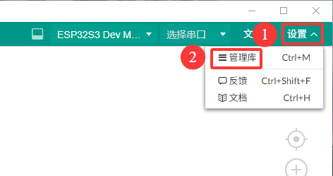

   2.选择本地导入，点击后找到存放库文件夹再选择库文件中的“.xml”后缀的文件导入。
   
   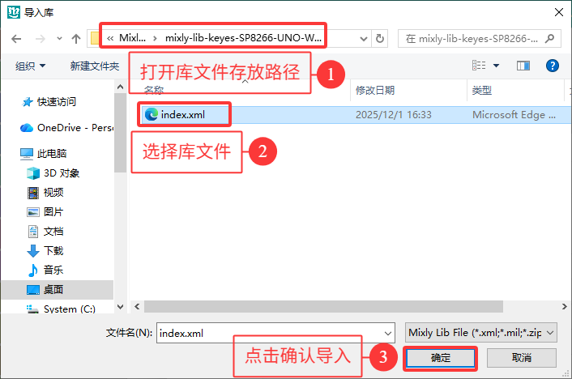
   
   3.导入成功
   
   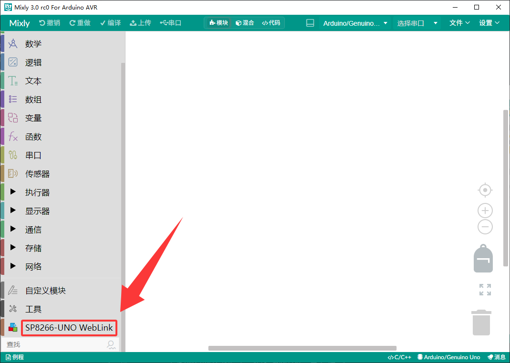
   
   

# 3.2.5 新建并保存代码文件

1. 点击“文件”--->“新建”

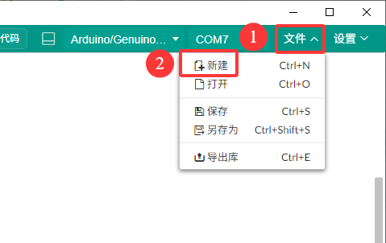

2. 在“串口栏”将设置波特率块与串口打印块托到代码编辑区

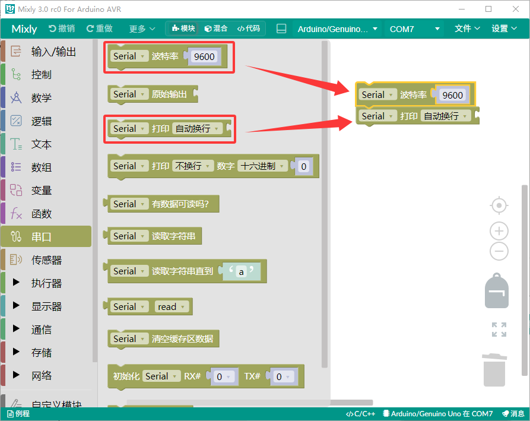

3. 在“文本栏”将文本代码块拖到串口打样块后面

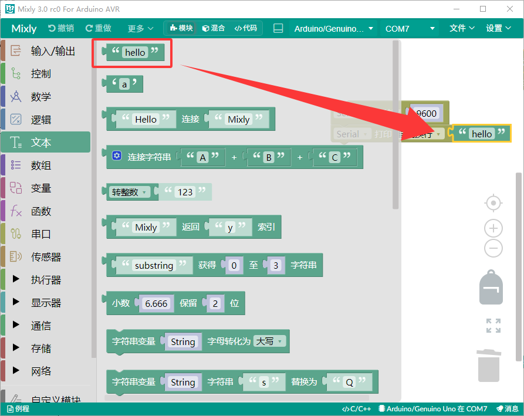

4. 点击“文件”--->“保存”

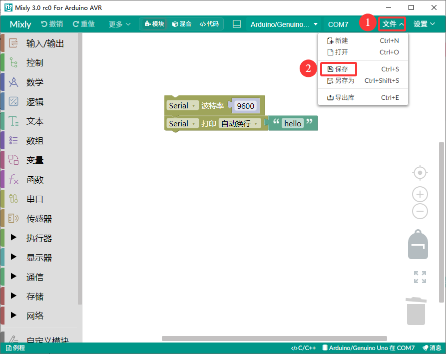

5. 选择你需要保存的路径，这里我们为了方便寻找保存到桌面的`Mixly`文件中（Mixly文件是自己创建的），设置代码文件名为“Hello”。

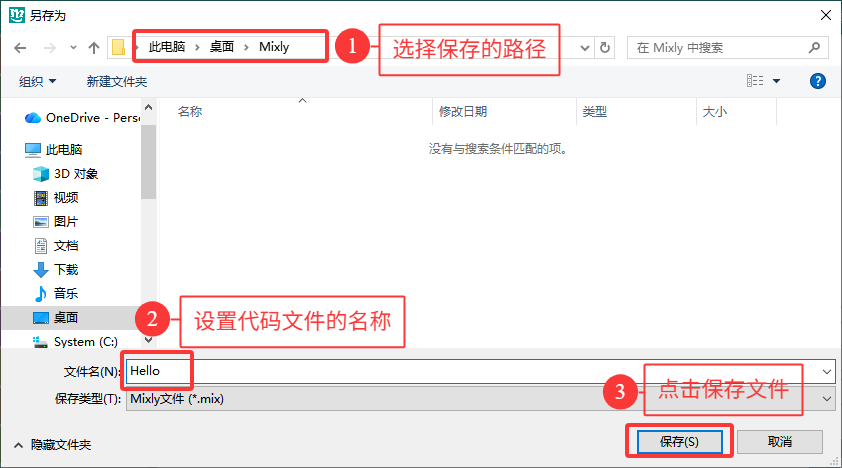

# 3.2.6 上传代码文件

1. 点击“文件”---->“打开”

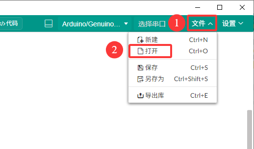

2. 我们以“3.2.5”课程中保存的代码文件为例，找到桌面的Mixly文件（注意：课程代码需要下载然后解压再打开文件步骤与这个一样）

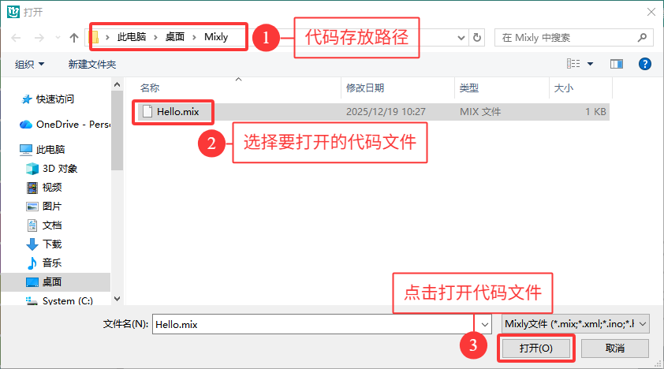

3. 点击“上传”。（注意：上传前要选择串口）

   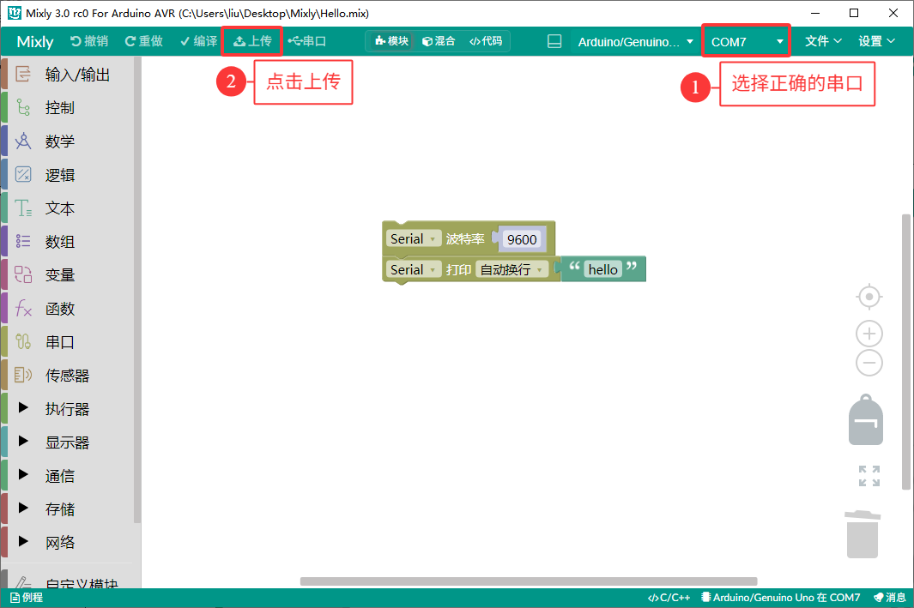
   
   

4. 等待上传完成，即可。

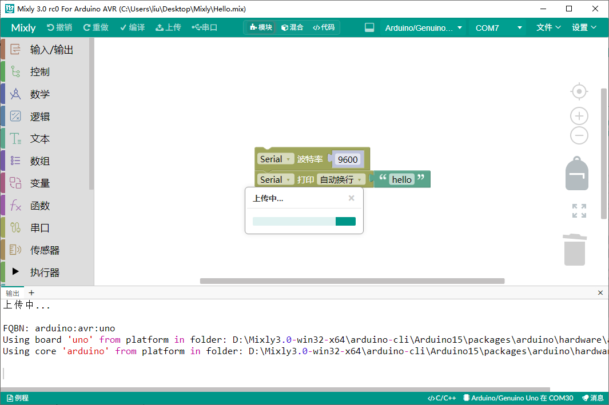

5. 下方输出栏中就会打印"hello"

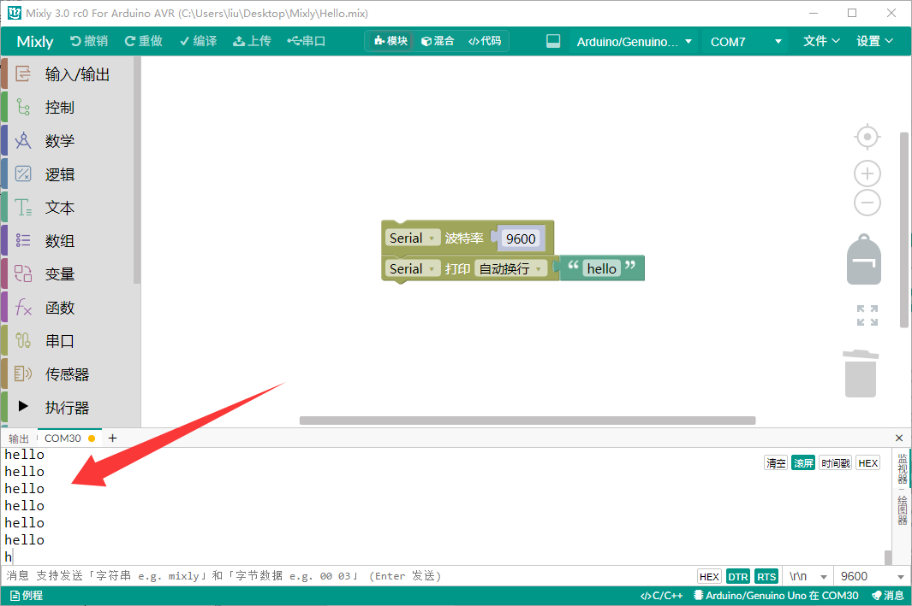
